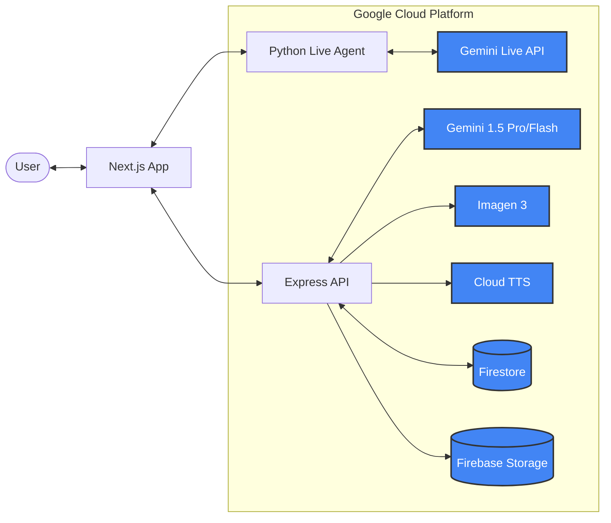

# Reptrainer (DealPilot) 🚀

> A real-time AI flight simulator for enterprise sales teams.

Reptrainer is an AI-powered sales roleplay platform that allows sales representatives to practice high-pressure buyer conversations using voice-based roleplay. It leverages the **Gemini Live API** to provide a seamless, low-latency training experience.

### **[🚀 Try the DealPilot Demo](https://reptrainerai.vercel.app/)**

## ⚡️ Quick Deployment

Deployment to Google Cloud is fully automated. Choose your path:

### 1. Full-Stack Automated Deployment (Recommended)

**No local setup required.** Deploys the AI Agent, API Proxy, and Web Frontend in a single orchestrated pipeline via the Google Cloud Console.
[](https://deploy.cloud.run/?git_repo=https://github.com/lucky-chap/reptrainer&utm_source=github&utm_medium=unpaidsoc&utm_campaign=GeminiLiveAgentChallenge&utm_content=reptrainer-fullstack)

### 2. Professional CLI Deployment

**Requires [Google Cloud SDK](https://cloud.google.com/sdk/docs/install) installed locally.** Deploy specific components or manage manual updates:

- **Full Stack Orchestrator**: `bash deploy-gcp.sh`
- **AI Agent (Python)**: `bash apps/live-agent/deploy.sh`
- **API Proxy (Node)**: `bash apps/api/deploy.sh`
- **Web Frontend (Next.js)**: `bash apps/web/deploy.sh`

---

## 📖 Table of Contents

- [📁 Gemini Live Agent Challenge: Submission Requirements](#-gemini-live-agent-challenge-submission-requirements)
- [🏗️ Architecture](#️-architecture)
- [✨ Key Features](#-key-features)
- [🧩 Core Concepts](#-core-concepts)
- [🏗️ Monorepo Structure](#️-monorepo-structure)
- [🛠️ Tech Stack](#️-tech-stack)
- [🚀 Getting Started](#-getting-started)
- [💻 Environment Variables](#-environment-variables)
- [🏃 Running the Application](#-running-the-application)
- [📊 Analytics & Insights](#-analytics--insights)
- [🔌 WebSocket Protocol](#-websocket-protocol)
- [🔐 Security Rules](#-security-rules)
- [🧪 Testing](#-testing)
- [📁 Project Structure](#-project-structure)
- [🤝 Contributing](#-contributing)
- [📄 License](#-license)

---

## 📁 Gemini Live Agent Challenge: Submission Requirements

This project is submitted to the **Gemini Live Agent Challenge**. Below are the required deliverables:

### 📃 Text Description & Findings

Detailed project features, technology stack, data sources, and findings/learnings:
👉 [Submission Description & Learnings](./submission_description.md)

### 📑 Technical Implementation (Hackathon Reference)

For the **Gemini Live Agent Challenge** judges, the following links point to the core implementation of Google Cloud services:

- **Live Agent Logic**: [main.py (L156-170)](./apps/live-agent/app/main.py#L156-170) - Gemini Live Bidi Config, [main.py (L264-269)](./apps/live-agent/app/main.py#L264-269) - ADK Live Runner.
- **Service Orchestration**: [vertex.ts (L21-29)](./apps/api/src/services/vertex.ts#L21-29) - Vertex AI, [vertex.ts (L390-397)](./apps/api/src/services/vertex.ts#L390-397) - Imagen 3.
- **Cloud TTS**: [tts.ts (L11-25)](./apps/api/src/services/tts.ts#L11-25) - Synthesis Implementation, [session.ts (L104-120)](./apps/api/src/routes/session.ts#L104-120) - Debrief Integration.
- **Grounding Evidence**: [vertex.ts (L72-82)](./apps/api/src/services/vertex.ts#L72-82) - Google Search Tool, [vertex.ts (L142, L309, L489)](./apps/api/src/services/vertex.ts#L142-L493) - Knowledge Base (RAG).
- **Firebase & Infrastructure**: [firebase.ts (L4-13)](./apps/api/src/config/firebase.ts#L4-13) - SDK Initialization, [cors.json](./apps/web/cors.json) - Storage CORS Policy, [storage.rules](./apps/web/storage.rules) - Security Rules.

### 🤖 Automation & Scalability

The project is optimized for industrial-grade deployment using **Google Cloud Build** and **Cloud Run**:

- **One-Command Orchestration**: The [deploy-gcp.sh](./deploy-gcp.sh) script automates the build and deployment of all three services, linking them automatically via environment variables.
- **Service-Level Scripting**: Each app directory contains its own `deploy.sh` (e.g., [apps/web/deploy.sh](./apps/web/deploy.sh)) for independent deployment of components while maintaining service links.
- **Master Build Pipeline**: [cloudbuild.yaml](./cloudbuild.yaml) provides a centralized way to build and deploy the entire multi-service architecture from a single trigger.
- **Serverless Scaling**: The stateless architecture allows each service (Next.js, Express, and Python) to scale horizontally on Google Cloud Run based on request load.

### 🏗️ Architecture Diagram

(See the [Architecture](#️-architecture) section below for the live Mermaid diagram)

### 📹 Demonstration Video

(Placeholder: Link to the 4-minute demo video will be provided in the official submission form)

---

## 🏗️ Architecture

Reptrainer (DealPilot) illustrates the flow of real-time audio, agentic reasoning, and multimodal state management.



### Data Flow Overview

1. **Real-time Voice**: User audio is streamed via WebSocket to the Python **Live Agent** service, which uses the **ADK** to communicate with the **Gemini Live API**.
2. **Contextual Grounding**: The agent retrieves product context from the **Firestore** knowledge base.
3. **Multimodal Debrief**: Upon session end, the **Express API** orchestrates **Vertex AI** for analysis, **Imagen 3** for infographics, and **Cloud TTS** for narration, storing all assets in **Firebase Storage**.

---

## ✨ Key Features

- **🎙️ Voice-First Roleplay**: High-fidelity, real-time voice conversations with AI buyer personas via Gemini Live API.
- **👁️ Whisper Coach**: A real-time HUD that analyzes your conversation and "whispers" tactical nudges and objection-handling strategies.
- **🧠 AI Persona Generation**: Instantly generate diverse buyer personas (from Skeptical CFOs to Decision Makers) tailored to your specific product.
- **📊 Coaching Insights**: Advanced analytics that identify skill gaps (Discovery, Closing, Listening, etc) and trends across your team.
- **🎞️ AI Debrief**: Post-session debriefs featuring synchronized audio narration, visual slides, and interactive objection heatmaps.
- **👥 Team Management**: Role-based access control for Admins (Team Leaders) and Members, with aggregated team performance dashboards.
- **🔄 Automatic Reconnection**: WebSocket connection with exponential backoff reconnection for reliable real-time sessions.
- **📝 Live Transcript**: Real-time transcript display with word-by-word reveal synced to audio playback.

---

## 🧩 Core Concepts

### Product-Persona Coupling

In Reptrainer, **Personas are tightly coupled to specific Products**.

Unlike generic AI chatbots, each buyer persona is generated with deep context about the product they are "buying." This includes:

- **Product-Specific Objections**: The AI knows the common friction points for that specific industry and solution.
- **Competitor Awareness**: Personas are aware of the specific competitors defined in the Product context.
- **Tailored Personalities**: A CFO persona for a cybersecurity product will have different priorities and skepticism than a CFO persona for an HR software.

This architectural decision ensures that every roleplay session is highly relevant and provides the most realistic training environment possible.

### Grounding & Context Strategy (Hybrid Knowledge + Dynamic Market Search)

Reptrainer uses a sophisticated "Knowledge-First" approach to grounding, balancing the depth of a local knowledge base with targeted, behavior-driven web search.

1. **RAG Knowledge Base (Consulted First)**: The AI persona always starts with your team's internal data. This includes company product info, competitor battle cards, market claims, and differentiators. This ensures zero-latency, high-accuracy responses for known context.
2. **Dynamic Market Search (Behavioral Fallback)**: The AI triggers a live Google Search tool _only_ when information is missing or needs real-world verification. To maintain realism, the AI behaves like a serious buyer doing research, limited to **3-4 searches per session**.
   - **Common Search Triggers**:
     - **Verifying Competitor Claims**: Validating comparisons the rep makes to rivals on-the-fly.
     - **Challenging Differentiation**: Checking if "unique" features exist elsewhere in the market.
     - **Checking Pricing & ROI**: Verifying cost savings or pricing models against public data.
     - **Investigating New Rivals**: Researching competitors mentioned during the call that aren't in the RAG corpus.
     - **Validating Integrations**: Checking CRM, Slack, or Salesforce compatibility claims.
     - **Researching Announcements**: Finding recent AI features or product launches from competitors.
     - **Evaluating Reputation**: Checking reviews or analyst mentions to challenge the rep's claims.
3. **Realism & Stability**: This hybrid model ensures that every roleplay session is anchored in your team's specific strategy while remaining dynamically aware of the living market.

---

## 🏗️ Monorepo Structure

```
reptrainer/
├── apps/
│   ├── web/          → Next.js frontend (TypeScript, Tailwind, shadcn/ui)
│   ├── api/          → Express backend proxy (TypeScript, Express, WebSocket)
│   └── live-agent/   → Python AI service (ADK, FastAPI, Vertex AI)
├── packages/
│   ├── shared/       → Shared types, constants, and utilities
│   └── tsconfig/     → Centralized TypeScript configurations
├── plans/            → Product specs & architectural decisions
├── package.json      → Root workspace management
└── pnpm-workspace.yaml
```

---

## 🛠️ Tech Stack

### Core

- **Framework**: [Next.js 15+](https://nextjs.org/) (App Router)
- **Backend**: [Express.js](https://expressjs.com/)
- **Language**: [TypeScript](https://www.typescriptlang.org/)
- **Styling**: [Tailwind CSS 4](https://tailwindcss.com/), [shadcn/ui](https://ui.shadcn.com/)

### AI & Intelligence

- **Live Voice**: [Gemini Live API](https://aistudio.google.com/) via WebSockets
- **Reasoning**: [Gemini 1.5 Pro/Flash](https://deepmind.google/technologies/gemini/) (via Vertex AI)
- **Narrations**: Google Cloud Text-to-Speech

### Infrastructure

- **Database**: [Firebase Firestore](https://firebase.google.com/docs/firestore) (Real-time sync)
- **Storage**: [Firebase Storage](https://firebase.google.com/docs/storage)
- **Auth**: [Firebase Authentication](https://firebase.google.com/docs/auth)

---

## 🚀 Getting Started

### Prerequisites

- **Node.js**: ≥ 20.x
- **pnpm**: ≥ 9.x
- **Python**: ≥ 3.11 (for the Live Agent service)
- **Google Cloud SDK (gcloud)**: (Optional, only for one-time setup or deployment)
- **Firebase CLI**: (Optional, only for one-time setup or deployment)
- **Docker & Docker Compose**: (Optional, for containerized setup)
- **Google Cloud Project**: With Vertex AI and Cloud TTS enabled.
- **Firebase Project**: With Auth, Firestore, and Storage enabled.

### ⚙️ Services Setup

> [!IMPORTANT]
> **One-Time Provisioning**: The steps below (Google Cloud, Firebase, Rules Deployment) only need to be performed **once per project**. If you are joining an existing project where the backend is already set up, you only need to obtain the `.env` values and skip to [Local Development](#local-development-non-docker).

#### 1. Google Cloud Platform

1. Create a project in [Google Cloud Console](https://console.cloud.google.com/).
2. Enable the following APIs:
   - **Vertex AI API**
   - **Cloud Text-to-Speech API**
3. Create a Service Account with `Vertex AI User` and `Cloud Text-to-Speech User` roles.
4. Download the JSON key and set `GOOGLE_APPLICATION_CREDENTIALS` if running outside of GCP.
5. Get a Gemini API Key from [Google AI Studio](https://aistudio.google.com/).

#### 2. Firebase & Storage Setup (Action Required)

For the app to work smoothly (saving sessions and loading multimodal assets), you must set up Firebase:

1. Create a project in [Firebase Console](https://console.firebase.google.com/).
2. **Authentication**: Enable Google Sign-In.
3. **Firestore**: Create a database in Native mode.
4. **Storage**: Enable Firebase Storage.
5. **CORS Configuration**: This is critical for the browser to load audio/images from Cloud Storage.
   - Ensure you have `gsutil` installed (part of the Google Cloud SDK).
   - Use the pre-configured [cors.json](./apps/web/cors.json) file.
   - Run the following command in your terminal:
     ```bash
     gsutil cors set apps/web/cors.json gs://YOUR_BUCKET_NAME
     ```

#### 3. Deploying Rules and Indices

The project includes pre-configured security rules and Firestore indices.

1. **Install Firebase CLI**:
   ```bash
   npm install -g firebase-tools
   ```
2. **Login and Select Project**:
   ```bash
   firebase login
   cd apps/web
   firebase use --add  # Select your project ID
   ```
3. **Deploy**:
   ```bash
   firebase deploy --only firestore:rules,firestore:indexes,storage
   ```

---

## 💻 Environment Variables

### API Backend (`apps/api/.env`)

```bash
# Environment
PORT=4000
NODE_ENV=development
CORS_ORIGIN=http://localhost:3000
API_SECRET_KEY=your-secure-secret-key-here

# Gemini API
GEMINI_API_KEY=your_gemini_api_key_here

# Google Cloud
GOOGLE_CLOUD_PROJECT=your_project_id
GOOGLE_CLOUD_LOCATION=europe-west1 # Note: Currently, RAG requires the `europe-west1` region to function correctly due to capacity limits.
```

### Live Agent Service (`apps/live-agent/.env`)

```bash
# Google Cloud Platform
GOOGLE_CLOUD_PROJECT=your_project_id
GOOGLE_CLOUD_LOCATION=us-central1

# Authentication (must match apps/api/.env API_SECRET_KEY)
API_SECRET_KEY=your-secure-secret-key-here

# Server
PORT=5000

# Optional: Service account key (if running outside GCP)
# GOOGLE_APPLICATION_CREDENTIALS=/path/to/service-account-key.json
```

### Web Frontend (`apps/web/.env.local`)

```bash
# API URL
NEXT_PUBLIC_API_URL=http://localhost:4000

# Secret Key (must match API_SECRET_KEY in backend)
NEXT_PUBLIC_API_SECRET_KEY=your-secure-secret-key-here

# Firebase Configuration
NEXT_PUBLIC_FIREBASE_API_KEY=your_api_key
NEXT_PUBLIC_FIREBASE_AUTH_DOMAIN=your_project_id.firebaseapp.com
NEXT_PUBLIC_FIREBASE_PROJECT_ID=your_project_id
NEXT_PUBLIC_FIREBASE_STORAGE_BUCKET=your_project_id.firebasestorage.app
NEXT_PUBLIC_FIREBASE_MESSAGING_SENDER_ID=your_sender_id
NEXT_PUBLIC_FIREBASE_APP_ID=your_app_id
```

### Required Environment Variables Summary

| Variable                     | Location  | Description                             |
| ---------------------------- | --------- | --------------------------------------- |
| `PORT`                       | API       | Server port (default: 4000)             |
| `API_SECRET_KEY`             | API + Web | Secret key for WebSocket authentication |
| `GEMINI_API_KEY`             | API       | Google AI Studio API key                |
| `GOOGLE_CLOUD_PROJECT`       | API       | GCP project ID                          |
| `GOOGLE_CLOUD_LOCATION`      | API       | GCP region (e.g., us-central1)          |
| `NEXT_PUBLIC_API_URL`        | Web       | Backend API URL                         |
| `NEXT_PUBLIC_API_SECRET_KEY` | Web       | Must match API's secret key             |
| `NEXT_PUBLIC_FIREBASE_*`     | Web       | Firebase web app config                 |

---

## 🏃 Running the Application

### Local Development (Non-Docker)

To run the entire stack locally, you need three terminals (or use `pnpm dev` for the Node services and a separate terminal for the Python service).

#### 1. Setup Node.js Services (Web & API)

```bash
# From the root directory
pnpm install

# Option A: Start both Web and API in parallel
pnpm dev

# Option B: Start them separately for better log visibility
pnpm dev:web    # Runs on http://localhost:3000
pnpm dev:api    # Runs on http://localhost:4000
```

#### 2. Setup Google Cloud Credentials

If you are running on a new local machine, you must authenticate to allow the Python code to access Google Cloud services:

```bash
# Install Google Cloud SDK first if you haven't (https://cloud.google.com/sdk/docs/install)
gcloud auth application-default login
```

#### 3. Setup Python Live Agent Service

The live agent service is the core AI logic and requires Python 3.11+.

```bash
cd apps/live-agent

# Create and activate a virtual environment
python3 -m venv .venv
source .venv/bin/activate

# Install dependencies
pip install -e .

# Run the service (defaults to http://localhost:5000)
uvicorn main:app --reload --port 5000
```

#### 3. Access the application

- **Frontend**: http://localhost:3000
- **API Backend**: http://localhost:4000
- **Live Agent (internal)**: http://localhost:5000 (The API proxy handles communication with this service)

### Docker Setup

1. **Configure environment variables**:

   ```bash
   # Create apps/api/.env and apps/web/.env.local with your config
   ```

2. **Build and start**:

   ```bash
   docker-compose up --build
   ```

3. **Access the application**:
   - Frontend: http://localhost:3000
   - API: http://localhost:4000

### Production Build

```bash
# Build all packages
pnpm build

# Start production servers
pnpm start
```

---

## 📊 Analytics & Insights

The application includes a sophisticated analytics engine that uses pattern recognition to help you grow. **Note: Personal insights and team patterns are generated once at least 3 sessions have been completed.**

- **Discovery**: How well you uncover customer needs.
- **Positioning**: Your ability to align product value.
- **Objection Handling**: Effectiveness in navigating pushback.
- **Closing**: Moving the deal towards the next step.

Managers can view **Team Weakness** alerts to identify where group training is needed most.

---

## 🔌 WebSocket Protocol

The real-time communication uses WebSockets at `/api/live`.

### Client → Server Messages

| Type          | Description                            |
| ------------- | -------------------------------------- |
| `audio`       | Base64-encoded PCM audio (16kHz, mono) |
| `text`        | Text input from user                   |
| `log_insight` | Request manual insight logging         |

### Server → Client Messages

| Type                   | Description                                     |
| ---------------------- | ----------------------------------------------- |
| `connected`            | Session established                             |
| `audio`                | Base64-encoded AI response audio                |
| `turn_complete`        | AI finished speaking                            |
| `input_transcription`  | User's speech transcribed                       |
| `output_transcription` | AI's speech transcribed                         |
| `interrupted`          | AI was interrupted by user                      |
| `tool_call`            | AI triggered a tool (e.g., `log_sales_insight`) |
| `error`                | Error message                                   |
| `closed`               | Session closed                                  |

---

## 🔐 Security Rules

### Firestore Rules (`apps/web/firestore.rules`)

The database uses role-based access control:

- Users can only read/write their own data
- Team admins can read/write team data
- All reads/writes require authentication

### Storage Rules (`apps/web/storage.rules`)

- Users can only upload to their own folder
- Audio recordings stored as `audio/{userId}/{sessionId}.webm`
- Avatar images stored as `avatars/{productId}/{personaId}.png`

---

## 🧪 Testing

```bash
# Run all tests
pnpm test

# Run tests in watch mode
pnpm test:watch

# Run linting
pnpm lint

# Run type checking
pnpm typecheck
```

---

## 📁 Project Structure

```
apps/
├── api/
│   ├── src/
│   │   ├── config/          # Environment configuration
│   │   ├── routes/          # Express routes
│   │   │   ├── auth.ts      # Authentication routes
│   │   │   ├── live.ts      # WebSocket live session
│   │   │   └── ...
│   │   ├── services/         # Business logic
│   │   │   ├── gemini-live.ts    # Gemini Live proxy
│   │   │   ├── vertex.ts        # Vertex AI helpers
│   │   │   └── ...
│   │   └── index.ts         # Express app entry
│   └── package.json
│
└── web/
    ├── components/          # React components
    │   ├── roleplay-session.tsx
    │   └── ...
    ├── hooks/               # Custom React hooks
    │   ├── use-gemini-live.ts   # Live session hook
    │   └── ...
    ├── lib/                 # Utilities
    ├── app/                 # Next.js App Router
    ├── public/              # Static assets
    └── package.json

packages/
└── shared/
    └── src/
        ├── constants.ts     # Shared constants
        └── types.ts         # TypeScript types
```

---

## 🤝 Contributing

1. Fork the repository
2. Create a feature branch (`git checkout -b feature/amazing-feature`)
3. Commit your changes (`git commit -m 'Add amazing feature'`)
4. Push to the branch (`git push origin feature/amazing-feature`)
5. Open a Pull Request

---

## 📄 License

MIT
