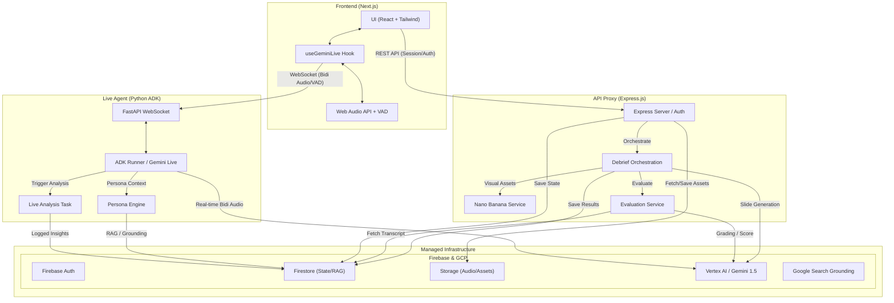

# Architecture Diagram

This diagram represents the system architecture for Reptrainer (DealPilot), illustrating the flow of real-time audio, agentic reasoning, and multimodal state management.

## Data Flow Summary

1.  **Live Session**: The frontend captures PCM audio and detects Voice Activity (VAD), streaming it directly to the Python Live Agent service via WebSockets.
2.  **Agentic Reasoning**: The Python service uses the Agent Development Kit (ADK) to interface with the Gemini Live API, providing real-time persona-based roleplay.
3.  **Multimodal Debrief**: Upon session completion, the Express backend orchestrates a complex "Debrief" generation flow:
    - **Gemini 1.5 Pro** analyzes the transcript to generate 4 coaching slides.
    - **Nano Banana** generates specific infographics for each slide.
    - **Cloud TTS** generates a personalized voiceover for each slide.
    - Assets are stored in **Firebase Storage** and delivered to the user as a synchronized multimodal presentation.
