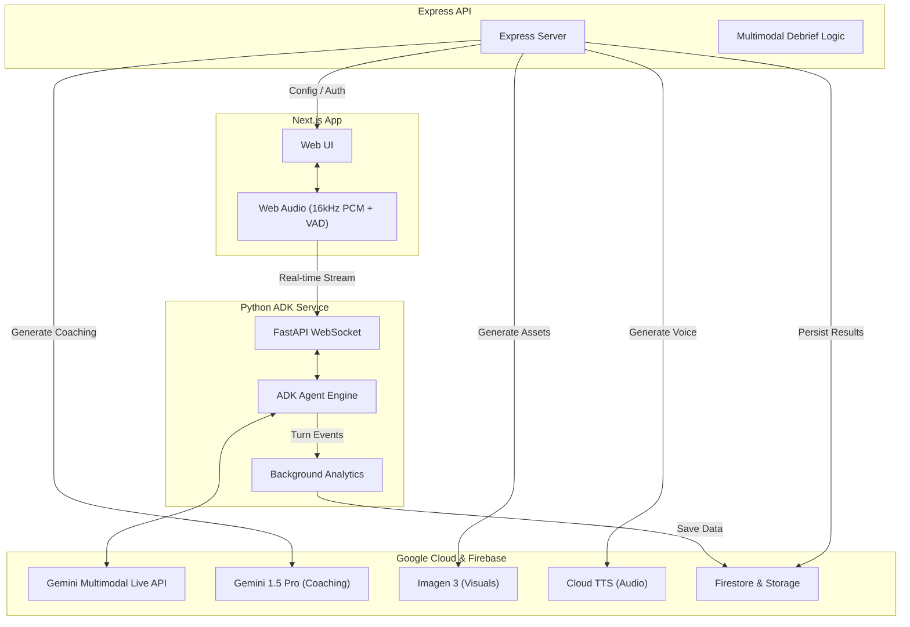

# Reptrainer Architecture (Simplified)

```mermaid
graph TD
    subgraph Frontend ["Next.js App"]
        UX["Web UI"]
        Audio["Web Audio (16kHz PCM + VAD)"]
    end

    subgraph Live_Agent ["Python ADK Service"]
        FastAPI["FastAPI WebSocket"]
        Engine["ADK Agent Engine"]
        Analytics["Background Analytics"]
    end

    subgraph API_Orchestrator ["Express API"]
        Node["Express Server"]
        Debrief["Multimodal Debrief Logic"]
    end

    subgraph Google_Cloud ["Google Cloud & Firebase"]
        GeminiLive["Gemini Multimodal Live API"]
        GeminiPro["Gemini 1.5 Pro (Coaching)"]
        Imagen["Imagen 3 (Visuals)"]
        TTS["Cloud TTS (Audio)"]
        DB["Firestore & Storage"]
    end

    %% Interactions
    UX <--> Audio
    Audio -- "Real-time Stream" --> FastAPI

    FastAPI <--> Engine
    Engine <--> GeminiLive
    Engine -- "Turn Events" --> Analytics
    Analytics -- "Save Data" --> DB

    Node -- "Config / Auth" --> UX
    Node -- "Generate Coaching" --> GeminiPro
    Node -- "Generate Assets" --> Imagen
    Node -- "Generate Voice" --> TTS
    Node -- "Persist Results" --> DB
```
